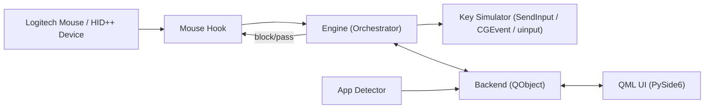

# Development Guide

This document contains the technical details a developer needs to navigate Mouser. The user-facing tour lives in [README.md](README.md); this guide covers how the codebase is wired together, how the platform-specific hooks behave, and how to build / debug locally.

## Contents

- [Development setup](#development-setup)
- [Architecture](#architecture)
- [Python entry point (Windows/Linux)](#python-entry-point-windowslinux-main_qmlpy)
- [How it works](#how-it-works)
  - [Mouse hook](#mouse-hook)
  - [Device catalog & layout registry](#device-catalog--layout-registry)
  - [Gesture button detection](#gesture-button-detection)
  - [App detector](#app-detector)
  - [Engine](#engine)
  - [Device reconnection](#device-reconnection)
  - [Configuration](#configuration)
- [UI overview](#ui-overview)
- [Project structure](#project-structure)
- [CLI flags & debug overrides](#cli-flags--debug-overrides)
- [Build internals](#build-internals)
- [Desktop shortcut (Windows)](#desktop-shortcut-windows)
- [Debugging tips](#debugging-tips)

## Development setup

Mouser has two platform implementations. macOS uses the Swift 6 / SwiftUI target in
`native/MouserNative`; Windows and Linux keep the Python/PySide6 implementation.

For Windows/Linux, install the Python dependencies before running the app or test suite:

```bash
python3 -m venv .venv
source .venv/bin/activate
python -m pip install -r requirements.txt
```

Run the test suite from the activated environment:

```bash
python -m unittest discover -s tests
```

For macOS, install Xcode 27 and XcodeGen, then generate and test the native project:

```bash
cd native/MouserNative
xcodegen generate
xcodebuild test -project MouserNative.xcodeproj -scheme MouserNative -destination 'platform=macOS'
```

## Python entry point (Windows/Linux): `main_qml.py`

`main_qml.py` is the Windows/Linux launch script, bringing together the core processing
logic (Engine) and the QML backend. It is retained for those platforms and is not used by
the native macOS application.

### What the Code is Responsible For

- **Environment Setup:** Defines absolute paths for development and frozen PyInstaller executables.
- **App Initialization:** Creates the `QApplication` and configures the Qt Material theme.
- **Engine Bootstrapping:** Initializes the core HID (Human Interface Device) engine and the UI backend.
- **QML Loading:** Registers context properties and image providers, then loads `Main.qml`.
- **System Integration:** Sets up the platform tray icon, startup state, and dark/light appearance.

### Key Classes and Functions

- `main()`: The main entry point. Orchestrates the startup sequence, initializes the `Engine` and `Backend`, loads the QML files, exposes Python objects to QML, creates the system tray, and starts the Qt event loop (`app.exec()`).
- `UiState(QObject)`: A bridge class that tracks the OS's system appearance (Dark vs. Light mode) and exposes it to the QML frontend via Qt Properties and Signals.
- `core/startup.py`: Owns startup integration for the Python platforms.
- `AppIconProvider` & `SystemIconProvider`: Subclasses of `QQuickImageProvider`. QML uses these to request images dynamically (e.g., rendering SVGs cleanly at various DPIs or reading native file icons via `QFileIconProvider`).
- `_app_icon()`, `_tray_icon()`, & `_render_svg_pixmap()`: Utility functions that construct high-resolution (`QIcon` / `QPixmap`) icons for the taskbar and the system tray, handling platform differences.

### How Data Flows Through the Code

1. **Configuration Flow:** Command-line args are parsed (`_parse_cli_args`) to configure hardware specifics like `--hid-backend` and startup behavior such as `--start-hidden`.
2. **Setup Flow:** The `Engine()` (core logic) and `Backend()` (QML interface) are instantiated.
3. **QML Binding:** Instances of the `Backend` and `UiState` are injected directly into the QML engine's root context. This allows the QML JavaScript/UI layer to read application state and invoke methods on the Python objects.
4. **Execution Flow:**
   - `qml_engine.load(...)` parses and renders `Main.qml`.
   - A deferral (`QTimer.singleShot(0, ...)`) is queued to start the `Engine` asynchronously.
   - If `--start-hidden` is present, the window is kept hidden and Mouser starts as a tray / menu-bar app first.
   - Execution hands over to `app.exec()`, blocking the main thread to run the Qt UI event loop.
   - `engine.stop()` gracefully shuts down background threads when the Qt event loop terminates.

### Non-Obvious Decisions and Tradeoffs

- **PyInstaller Pathing (`getattr(sys, "frozen", ...)`)**: Handles source and packaged Windows/Linux paths.
- **Deferred Engine Start:** The core `engine.start()` is wrapped in `QTimer.singleShot(0, ...)`. This ensures the graphical window renders and appears BEFORE the potentially blocking process of binding to HID devices occurs.
- **Hardcoded PySide6 Plugin Paths:** `QML2_IMPORT_PATH` and `QT_PLUGIN_PATH` are manually set via `os.environ` to work around PyInstaller/PySide6 edge cases where the QML engine fails to locate basic QML modules when bundled.
- **Startup Benchmarks:** Explicit timing logic (`_t0`, `_t1`, ..., `_t8`) is used to profile startup times. Because importing heavy UI frameworks like Qt in Python can be slow, this enforces performance budgets.

## Architecture



The diagram above describes the Windows/Linux Python runtime. The macOS runtime is fully
native: CoreHID discovers Logitech interfaces, a non-exclusive IOKit transport exchanges
HID++ reports, CoreGraphics event taps rewrite pointer events, and `WorkspaceModel` binds
the runtime directly to SwiftUI. It also owns wake/unlock recovery and re-subscribes when
the CoreHID notification stream is reset.

## How it works

### Mouse hook

Mouser exposes a single `MouseHook` façade in [`core/mouse_hook.py`](core/mouse_hook.py) and dispatches to a per-platform implementation:

- **Windows** — [`core/mouse_hook_windows.py`](core/mouse_hook_windows.py): `SetWindowsHookExW` with `WH_MOUSE_LL` on a dedicated background thread, plus Raw Input for extra mouse data.
- **macOS** — [`core/mouse_hook_macos.py`](core/mouse_hook_macos.py): `CGEventTap` for interception and Quartz events for key simulation. The tap callback is wrapped with `@_autoreleased` to recycle Foundation objects every event (closing a ~1.4 GB leak that appeared under load) and the tap auto re-enables itself when the system disables it on timeout. Because action *execution* runs on other pool-less threads (the mouse-hook dispatch worker, the HID gesture thread, and the safety-release timers), the dispatch worker also wraps `_dispatch` in an autorelease pool and the [`core/key_simulator.py`](core/key_simulator.py) injection entry points are `@_autoreleased` too — otherwise the `CGEvent`/`NSEvent` objects created per click leak for the process lifetime (issue #233).
- **Linux** — [`core/mouse_hook_linux.py`](core/mouse_hook_linux.py): `evdev` to grab the physical mouse and `uinput` to forward pass-through events through a virtual device.
- **Stub** — [`core/mouse_hook_stub.py`](core/mouse_hook_stub.py): inert hook for unsupported platforms / smoke tests.

Horizontal-scroll direction is decided once, in `hscroll_event_type()` ([`core/mouse_hook_types.py`](core/mouse_hook_types.py)): a positive delta is a rightward tilt on all three platforms. Each hook used to spell the comparison out itself, and Windows had it inverted for months — a wheel tilted right fired the left binding (issue #253).

The shared base + types live in [`core/mouse_hook_base.py`](core/mouse_hook_base.py), [`core/mouse_hook_contract.py`](core/mouse_hook_contract.py), and [`core/mouse_hook_types.py`](core/mouse_hook_types.py).

All paths feed the same internal event model and intercept:

- `WM_XBUTTONDOWN/UP` — side buttons (back / forward)
- `WM_MBUTTONDOWN/UP` — middle click
- `WM_MOUSEHWHEEL` — horizontal scroll
- `WM_MOUSEWHEEL` — vertical scroll (for inversion)

Intercepted events are either **blocked** (hook returns `1`) and replaced with an action, or **passed through** to the foreground application. Synthetic events Mouser injects itself are tagged so the hook ignores them on the way back in (Windows uses an event marker; macOS uses `kCGEventSourceUserData`).

### Device catalog & layout registry

- [`core/logi_device_catalog.py`](core/logi_device_catalog.py) holds Mouser's curated per-device Logitech specs, image assets, and hotspot coordinates for dedicated control surfaces.
- [`core/logi_devices.py`](core/logi_devices.py) resolves known product IDs and model aliases into a `ConnectedDeviceInfo` record with display name, DPI range, preferred gesture CIDs, supported buttons, and default UI layout key.
- [`core/device_layouts.py`](core/device_layouts.py) stores built-in family layouts plus catalog layouts, layout notes, and whether a layout is interactive or only a generic fallback. `_FAMILY_FALLBACKS` maps per-model keys to family layout keys until a dedicated overlay exists.
- [`ui/backend.py`](ui/backend.py) combines auto-detected device info with any persisted per-device layout override and exposes the effective layout to QML.

### Gesture button detection

Logitech gesture / thumb buttons do not always appear as standard mouse events. Mouser uses a layered detector inside [`core/hid_gesture.py`](core/hid_gesture.py):

1. **HID++ 2.0 (primary)** — opens the Logitech HID collection, discovers `REPROG_CONTROLS_V4` (feature `0x1B04`), ranks gesture CID candidates from the device registry plus control-capability heuristics, and diverts the best candidate. When supported, RawXY movement data is also enabled.
2. **Raw Input (Windows fallback)** — registers for raw mouse input and detects extra button bits beyond the standard 5.
3. **Gesture tap / swipe dispatch** — a clean press/release emits `gesture_click`; once movement crosses the configured threshold, Mouser emits directional swipe actions instead.

The same module owns the SmartShift integration. It prefers the enhanced feature `0x2111` (`FEAT_SMART_SHIFT_ENHANCED`) when available and falls back to `0x2110`, exposing both an enable flag and a sensitivity threshold; pending settings are re-applied on every reconnect (including wake-from-sleep).

### App detector

[`core/app_detector.py`](core/app_detector.py) polls the foreground window every 300ms.

- **Windows:** `GetForegroundWindow` → `GetWindowThreadProcessId` → process name. UWP apps are resolved via `ApplicationFrameHost.exe` to the actual child process. That resolution enumerates every top-level window and opens each owning process, so `classify_explorer_window()` triages `explorer.exe` windows first: real Explorer surfaces are the app, transient shell windows (taskbar previews, Alt-Tab, context menus) are skipped outright, and any other window is resolved at most once — its handle and class are memoised when nothing is found behind it. Without that triage a context menu or taskbar preview held the foreground and re-ran the full scan three times a second, starving the mouse hook (issue #252).
- **macOS:** `NSWorkspace.frontmostApplication`.
- **Linux:** `xdotool` (X11) and `kdotool` (KDE Wayland). Other Wayland compositors fall back to the default profile.

### Engine

[`core/engine.py`](core/engine.py) is the orchestrator. On app change, it performs a **lightweight profile switch** — clears and re-wires hook callbacks without tearing down the hook thread or HID++ connection. This avoids the latency and instability of a full hook restart. The engine also forwards connected-device identity to the backend so QML can render the right model name and layout state, and routes mouse-injection actions (`mouse_left_click`, `mouse_right_click`, …) through `inject_mouse_down` / `inject_mouse_up`.

### Device reconnection

Mouser handles mouse power-off / on cycles automatically:

- **HID++ layer** — `HidGestureListener` detects device disconnection (read errors) and enters a reconnect loop, retrying every 2–5 seconds until the device returns. Pending SmartShift / scroll-mode settings are replayed on reconnect.
- **Hook layer** — `MouseHook` listens for `WM_DEVICECHANGE` (Windows) and platform equivalents elsewhere, reinstalling the low-level hook when devices are added or removed.
- **UI layer** — connection state and device identity flow from HID++ → MouseHook → Engine → Backend (cross-thread safe via Qt signals) → QML, updating the status badge, device name, and active layout in real time.

### Configuration

All settings live in `config.json` under the platform config dir (`%APPDATA%\Mouser`, `~/Library/Application Support/Mouser`, `~/.config/Mouser`). The schema supports:

- Multiple named profiles with per-profile button mappings, including gesture tap + swipe actions
- Per-profile app associations (list of `.exe` / bundle / process names)
- Global settings: DPI, scroll inversion, macOS trackpad filtering, gesture tuning, appearance, debug flags, Smart Shift mode + sensitivity, language, and startup preferences (`start_at_login`, `start_minimized`)
- Per-device layout override selections for unsupported devices
- Automatic migration from older config versions (current version `11`)

Logs are written via [`core/log_setup.py`](core/log_setup.py) to a 5 × 5 MB rotating file in `~/Library/Logs/Mouser`, `%APPDATA%\Mouser\logs`, or `$XDG_STATE_HOME/Mouser/logs`. The setup is idempotent and safe to call multiple times — `main_qml.py` invokes it before any Qt or core import so startup output is captured from the very first line.

## UI overview

Two pages accessible from a slim sidebar in [`ui/qml/Main.qml`](ui/qml/Main.qml):

### Mouse & profiles

- **Left panel** — list of profiles. The "Default (All Apps)" profile is always present. Per-app profiles show the app icon and name. Selecting a profile binds it as the active editing target.
- **Right panel** — device-aware mouse view. MX Master and MX Anywhere family devices get clickable hotspot dots on the image; unsupported layouts fall back to a generic device card with an experimental "try another supported map" picker.
- **Add profile** — combo box at the bottom lists known apps (Chrome, Edge, VS Code, VLC, etc.). Click `+` to create a per-app profile.

### Custom shortcut recorder

[`ui/qml/KeyCaptureDialog.qml`](ui/qml/KeyCaptureDialog.qml) has two deliberately separate input modes:

- **Record keys** (default) — the field is read-only and every key press becomes the shortcut. Held modifiers show as a `Ctrl + …` hint until a non-modifier key lands.
- **Type instead** — a plain text field, so shifted characters such as `+` can be typed without the Shift press replacing the shortcut being written.

On Windows the Super key can't be recorded through Qt alone: the shell acts on the `LWIN`/`RWIN` key-up, so pressing it opens the Start menu and takes focus away from the dialog. While recording, [`core/key_capture.py`](core/key_capture.py) installs a `WH_KEYBOARD_LL` hook that swallows *only* those two virtual keys (injected events are always passed through, so mouse-fired shortcuts keep working) and reports their pressed state to the backend, which folds it into the recorded combo as `Qt.MetaModifier`. The guard is released when the dialog closes, when the mode switches to typing, when the app loses focus, and on `aboutToQuit` — a leaked hook could otherwise swallow the Windows key app-wide. Every other platform gets a no-op guard.

### Point & scroll

- **DPI slider** — 200 to the device max with quick presets (400, 800, 1000, 1600, 2400, 4000, 6000, 8000). Reads the current DPI from the device on startup.
- **Scroll inversion** — independent toggles for vertical and horizontal scroll direction.
- **Ignore trackpad (macOS)** — keep trackpad and Magic Mouse continuous scroll out of Mouser mappings. Disable only if you intentionally want Mouser to handle them.
- **Smart Shift** — toggle ratchet ↔ free-spin (HID++ `0x2111`) plus a sensitivity threshold; status syncs every 15 s and on every reconnect.
- **Startup controls** — **Start at login** (Windows + macOS) and **Start minimized** (all platforms).

The window itself is resizable: default 1060 × 700 with a 920 × 620 minimum (`ApplicationWindow` in [`ui/qml/Main.qml`](ui/qml/Main.qml)). Inner pages use `Layout.fillWidth` / `Layout.fillHeight`, so panels reflow as the window grows.

## Project structure

```
mouser/
├── main_qml.py                  # Application entry point (PySide6 + QML)
├── Mouser.bat                   # Quick-launch batch file
├── Mouser.spec / Mouser-linux.spec   # Windows/Linux PyInstaller specs
├── Mouser-mac.spec / build_macos_app.sh # Legacy Python macOS packaging; not released
├── build.bat                    # Windows build (installs deps, verifies hidapi, packages)
├── native/MouserNative/         # Swift 6 / SwiftUI macOS 27 application and tests
├── packaging/linux/             # 69-mouser-logitech.rules + install-linux-permissions.sh
├── .github/workflows/
│   ├── ci.yml                   # CI checks (compile, tests, QML lint)
│   └── release.yml              # Windows/Linux packages + native universal macOS DMGs
├── README.md / README_CN.md / readme_mac_osx.md / CONTRIBUTING_DEVICES.md / DEVELOPMENT.md
├── requirements.txt
│
├── core/                        # Backend logic
│   ├── accessibility.py         # macOS Accessibility trust checks
│   ├── app_catalog.py           # Known apps + per-profile metadata
│   ├── app_detector.py          # Foreground app polling
│   ├── config.py                # Config manager (JSON load/save/migrate)
│   ├── device_layouts.py        # Device-family layout registry for QML overlays
│   ├── engine.py                # Core engine — wires hook ↔ simulator ↔ config
│   ├── hid_gesture.py           # HID++ 2.0 gesture button + SmartShift (0x2110/0x2111)
│   ├── key_capture.py           # Windows-key guard for the shortcut recorder
│   ├── key_simulator.py         # Platform-specific action simulator
│   ├── linux_permissions.py     # hidraw / event / uinput permission report
│   ├── log_setup.py             # Rotating file log + stdout redirection
│   ├── logi_device_catalog.py   # Curated Logitech specs, assets, and hotspots
│   ├── logi_devices.py          # Known Logitech device catalog + connected-device metadata
│   ├── mouse_hook.py            # Platform dispatcher façade
│   ├── mouse_hook_base.py       # Shared base class
│   ├── mouse_hook_contract.py   # Hook protocol / type stubs
│   ├── mouse_hook_types.py      # Event enums
│   ├── mouse_hook_windows.py    # WH_MOUSE_LL + Raw Input
│   ├── mouse_hook_macos.py      # CGEventTap + Quartz
│   ├── mouse_hook_linux.py      # evdev + uinput
│   ├── mouse_hook_stub.py       # Inert hook (unsupported platforms / tests)
│   ├── startup.py               # Login startup (Windows registry + macOS LaunchAgent)
│   └── version.py               # APP_VERSION / commit / build mode
│
├── ui/                          # UI layer
│   ├── backend.py               # QML ↔ Python bridge (QObject)
│   ├── locale_manager.py        # en / zh_CN / zh_TW translations + button/action labels
│   └── qml/
│       ├── Main.qml             # App shell (sidebar + page stack + tray toast)
│       ├── MousePage.qml        # Merged mouse diagram + profile manager
│       ├── ScrollPage.qml       # DPI slider + scroll/SmartShift toggles
│       ├── KeyCaptureDialog.qml # Custom shortcut recorder (record / type modes)
│       ├── HotspotDot.qml       # Interactive button overlay on mouse image
│       ├── ActionChip.qml       # Selectable action pill
│       ├── AppIcon.qml          # File-icon helper for known apps
│       └── Theme.js             # Shared colors and constants
│
├── tests/                       # unittest suite (logi_devices, hid_gesture, engine, hooks, …)
└── images/                      # Logos, app icons, mouse diagrams, screenshots
```

## Python-only CLI flags & debug overrides

These flags are parsed by [`main_qml.py`](main_qml.py) and apply only to the
Windows/Linux Python implementation. The native macOS app uses its settings UI,
`SMAppService`, and a fixed CoreHID + non-exclusive IOKit transport.

| Flag | Behavior |
|---|---|
| `--start-hidden` | Boot directly into the tray / menu bar; combined with the `start_minimized` config preference. |
| `--hid-backend=<auto\|hidapi\|iokit>` | Force a Python HID transport for compatibility debugging. |

Example:

```bash
python main_qml.py --hid-backend=hidapi
python main_qml.py --start-hidden
```

## Build internals

### Windows

```powershell
build.bat                 # standard packaged build (installs deps, verifies hidapi, runs PyInstaller)
build.bat --clean         # nuke build/ and dist/ before rebuilding

# Manual path
pip install -r requirements.txt pyinstaller
pyinstaller Mouser.spec --noconfirm
```

`build.bat` fails early if `hidapi` is not importable, which prevents shipping a build that cannot detect Logitech devices. Output: `dist\Mouser\` — zip the folder for distribution.

### macOS

```bash
cd native/MouserNative
xcodegen generate
xcodebuild test -project MouserNative.xcodeproj -scheme MouserNative -destination 'platform=macOS'
```

The macOS target is a Swift 6 / SwiftUI app using current macOS 27 APIs. Run
`./release.sh` for universal Developer ID signed and notarized Release/Debug DMGs. The
script retrieves notarization authorization only from the `Mouser-Notary` Keychain
profile. Release automation requires a trusted self-hosted macOS runner labelled
`mouser-release`, because Developer ID and notarization credentials remain in that
runner's Keychain. Native CI uses the same runner so its Xcode 27 SDK matches the
macOS 27 deployment target; the test job does not access signing or notarization
credentials. Python and PyInstaller remain for Windows/Linux builds only.

### Linux

```bash
sudo apt-get install libhidapi-dev
pip install pyinstaller
pyinstaller Mouser-linux.spec --noconfirm
```

Output: `dist/Mouser/`. The release pipeline additionally bundles the Linux permission helper files and hicolor app-icon ladder, runs `ldd` on the resulting binary to flag missing libraries, and performs an offscreen smoke test (`QT_QPA_PLATFORM=offscreen`).

## Desktop shortcut (Windows)

Create a `Mouser.lnk` shortcut that launches via `pythonw.exe` if you want to run from source without a console window:

```powershell
$s = (New-Object -ComObject WScript.Shell).CreateShortcut("$([Environment]::GetFolderPath('Desktop'))\Mouser.lnk")
$s.TargetPath = "C:\path\to\mouser\.venv\Scripts\pythonw.exe"
$s.Arguments = "main_qml.py"
$s.WorkingDirectory = "C:\path\to\mouser"
$s.IconLocation = "C:\path\to\mouser\images\logo.ico, 0"
$s.Save()
```

## Debugging tips

- **Python thread dump:** `kill -USR1 $(pgrep -f main_qml.py)` triggers `_dump_threads` on Windows/Linux source runs.
- **Python startup timing:** `_t0`–`_t8` markers in `main_qml.py` log per-phase startup costs.
- **Python HID transport override:** `--hid-backend=iokit|hidapi|auto` isolates compatibility transport bugs; it is not a native macOS option.
- **Logs:** `~/Library/Logs/Mouser/mouser.log`, `%APPDATA%\Mouser\logs\mouser.log`, or `$XDG_STATE_HOME/Mouser/logs/mouser.log`. Stdout is redirected through the rotating file handler; stderr is preserved so logging-handler errors don't recurse.
- **Linux permissions:** [`core/linux_permissions.py`](core/linux_permissions.py) emits a `LinuxPermissionReport` describing which `/dev/hidraw*`, `/dev/input/event*`, and `/dev/uinput` nodes are blocked. Mouser surfaces this via the UI banner and the log.
