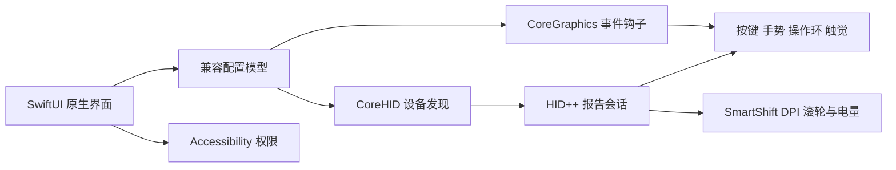

# ADR-001：采用渐进式 SwiftUI 原生迁移

- **状态**：实现完成，真实设备与锁屏恢复验收中
- **日期**：2026-07-28
- **背景**：当前 PySide6/QML 界面跨平台但与 macOS 系统设计语言存在差距；鼠标事件、锁屏恢复和 HID++ 设备控制已经稳定，整体重写会扩大回归风险。
- **候选方案**：继续优化 QML；一次性 Swift 重写；SwiftUI 界面先行并逐步迁移核心。
- **决策**：先建立独立 SwiftUI 应用壳和兼容配置模型，再按权限、配置、事件钩子、HID++ 的顺序迁移。
- **正面后果**：可以快速验证原生设计；现有 3.7.3 保持可用；每个底层模块都能独立回归。
- **负面后果**：迁移期间会短期维护两套实现；完整跨平台版本仍继续依赖 Python/QML。

## 当前进度

- SwiftUI 界面、配置兼容层和 Accessibility 授权：已完成。
- CoreGraphics 滚轮事件钩子与锁屏/唤醒重建：已完成，默认由用户显式启用。
- CoreHID 设备发现、非独占 IOKit 报告收发、HID++ 会话与接收器槽位探测：已完成，正式版默认启用。
- DPI、SmartShift、滚轮模式、电量和横纵滚轮反转的状态同步及实际设备接管：已完成；锁屏恢复会重新连接并重放设置。
- 按键映射、动作执行、手势、操作环、触觉反馈、截图、应用配置与更新安装：已完成。
- 正式应用身份、Developer ID 签名、公证、Release/Debug DMG：已完成构建流水线；最终真实设备锁屏恢复验收通过后结束迁移。
- macOS 发行不再依赖 Python、PySide6 或 Qt；跨平台 Python 代码继续供 Windows/Linux 使用。

